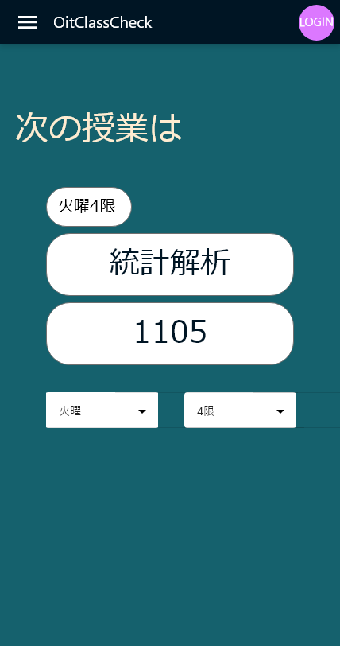
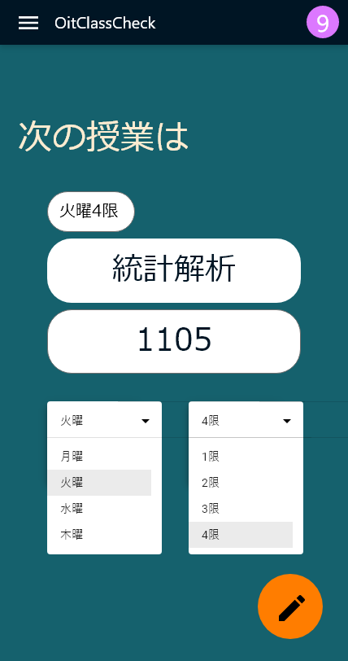

# 開発案
  **920017 遠藤 哲**

<!--
みなさんは普段学校でこんな会話したことはありませんか？
-->

---
layout: center
class: text-center
---

# **次の授業って何だっけ?**
  # **教室ってどこだっけ?**

<!--
私たち学生にとってはこの縦長のキャンパスで次の授業が上の階なのか、下の階なのかこのままの教室なのかはとても重要な問題です。
そのため、私たち学生は次のような行動にでます。
-->

---

# **現状の解決策**
  - ### 友だちに聞く
  - ### 授業時間割表やポータルで確認する
  - ### 予め自分で作って置いた時間割表を確認する
  - ### サボる

<!--
もっとスマート解決したい！
-->

---
layout: center
---

# **新しい解決策**

<!--
そこで考えた新しい解決策がこちらです
-->

---
layout: two-cols
---

# **仮UI**
  <ul class="image">
    <li class="noColum"></li>
    <li class="noColum"></li>
  </ul>

  

::right::
  # **授業確認アプリ**
  - ### アクセスすると次の授業や一週間の授業が確認できる**webアプリ**
  - ### LOGINすると自分の履修内容に編集できるor自動で自分の履修内容を確認できる
  - ### LOGINで留年にも対応
  - ### 梅田キャンパスのみ対応

<!--
これは、ユーザーがサイトにアクセスし、学生番号を入力すると授業と教室を教えてくれるサービス。ログイン認証すると自分の履修にカスタマイズできる。
-->

---
layout: two-cols
---

# **仮UI**
  <ul class="image">
    <li class="noColum"></li>
    <li class="noColum"></li>
  </ul>

  

::right::
  # **そんなサービス作れるのか?**
  - ### 梅田キャンパスの学生は履修内容がほどんど同じ!
  - ### 各教室にある出席管理システムの情報が取れれば最高
  - ### バックエンド側,認証周りの処理はFirebaseで実装
  - ### 上の二つができなくても履修の情報は$(S + R + W) \times 4年間$でいいのでこちら側でデータベース作ってもいい。

<!--
梅田キャンパスはみんなほとんど履な内容が同じ。だから、個人で時間割を管理するより大学側が管理したほうが効率的。
-->

---
layout: center
---

# **もうキャンパスでは迷子にならない!**

